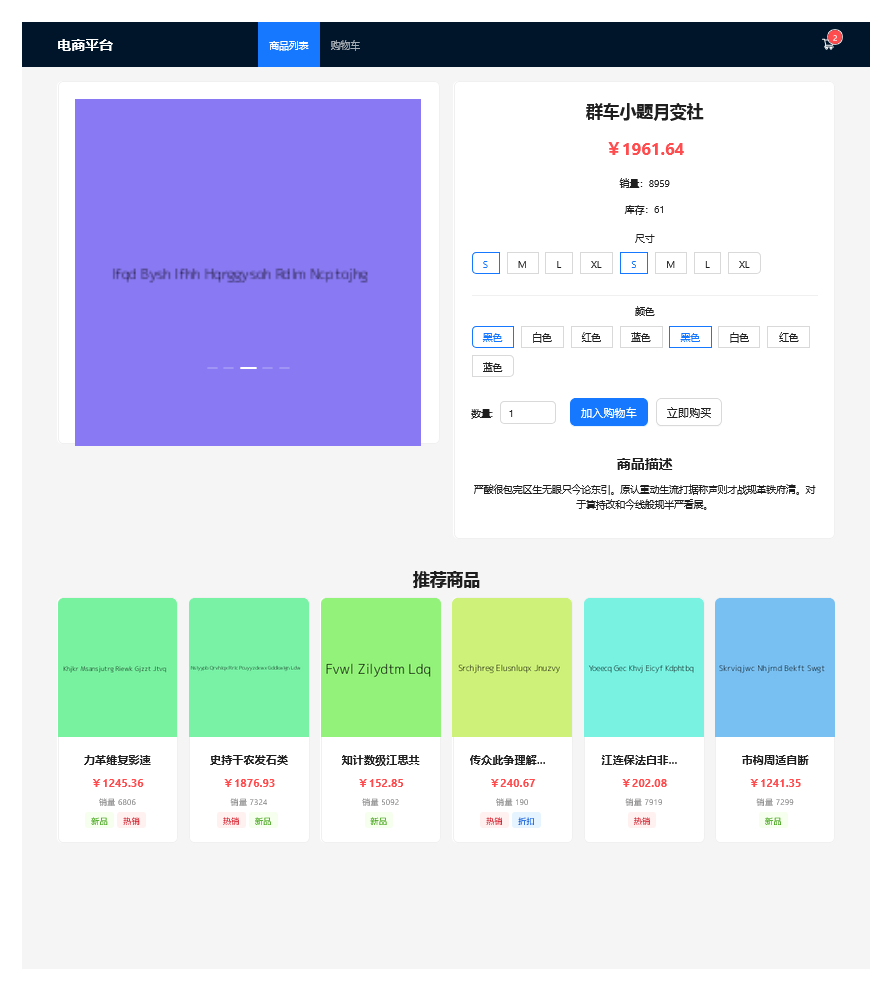
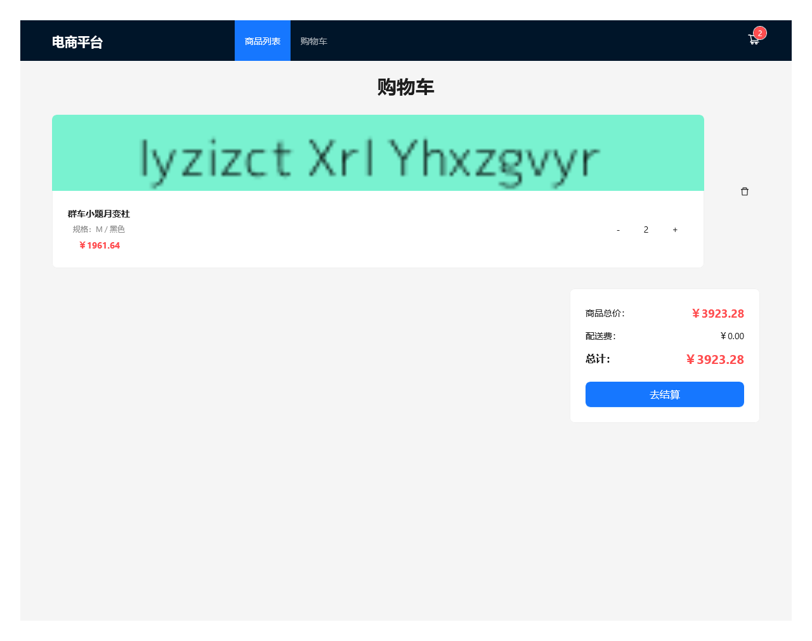

## 电商平台作业项目

### 项目简介
这是一个基于React + TypeScript + Vite的电商平台作业项目，实现了商品列表、商品详情和购物车等核心功能。

### 功能特点

#### 1. 商品列表页面
- 展示商品卡片列表，包含商品名称、价格、销量和标签
- 支持按价格升序/降序、销量排序
- 支持分页浏览商品
- 顶部导航栏，包含商品列表和购物车链接


#### 2. 商品详情页面
- 展示商品图片轮播
- 显示商品名称、价格、销量、库存等信息
- 支持商品规格选择（尺寸、颜色）
- 支持数量选择
- 加入购物车功能
- 推荐商品展示



#### 3. 购物车页面
- 展示购物车中的商品列表
- 支持调整商品数量
- 支持移除购物车中的商品
- 显示商品总价和结算按钮
- 空购物车状态提示



### 技术栈

- **前端框架**: React 18
- **开发语言**: TypeScript
- **构建工具**: Vite
- **UI组件库**: Ant Design
- **状态管理**: Zustand
- **路由管理**: React Router
- **数据模拟**: Mock.js

### 项目结构

```
src/
├── components/           # 组件目录
│   ├── business/        # 业务组件
│   │   ├── ProductCard.tsx      # 商品卡片组件
│   │   ├── SpecSelector.tsx      # 规格选择组件
│   │   └── CartDrawer.tsx        # 购物车抽屉组件
│   └── common/          # 通用组件
│       ├── Navbar.tsx           # 导航栏组件
│       ├── FilterComponent.tsx  # 筛选组件
│       └── PaginationComponent.tsx # 分页组件
├── pages/               # 页面目录
│   ├── ProductList.tsx   # 商品列表页面
│   ├── ProductDetail.tsx # 商品详情页面
│   └── CartPage.tsx      # 购物车页面
├── store/               # 状态管理
│   └── productStore.ts  # 商品和购物车状态管理
├── mock/                # 模拟数据
│   └── products.ts      # 商品模拟数据
├── App.tsx              # 应用入口组件
└── main.tsx             # 应用渲染入口
```

### 安装和运行

#### 安装依赖
```bash
npm install
```

#### 启动开发服务器
```bash
npm run dev
```

#### 构建生产版本
```bash
npm run build
```

#### 预览生产版本
```bash
npm run preview
```

### 开发说明

1. **数据模拟**: 使用Mock.js生成模拟商品数据，无需后端接口
2. **状态管理**: 使用Zustand进行轻量级状态管理，管理商品列表、筛选条件、排序方式和购物车状态
3. **路由配置**: 使用React Router配置应用路由，包含商品列表、商品详情和购物车页面
4. **组件设计**: 采用组件化开发，将通用组件和业务组件分离，提高代码复用性